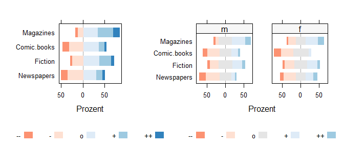
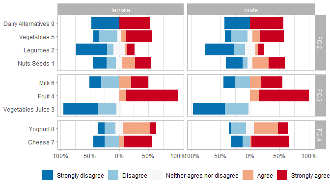
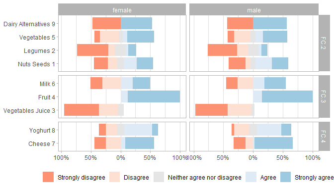
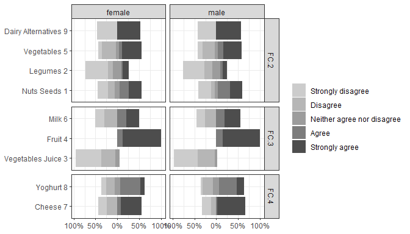
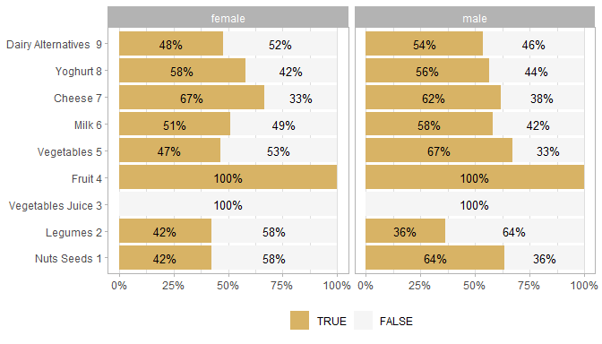
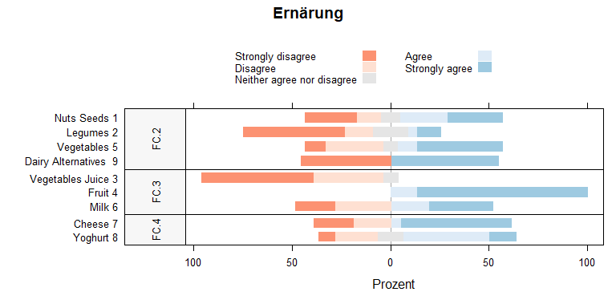
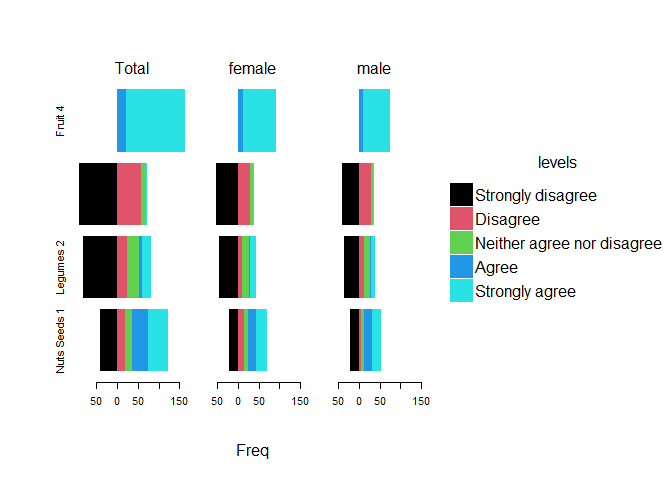
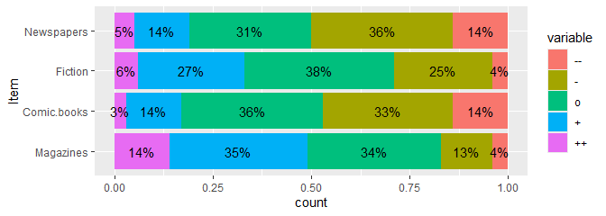

Likert-Grafiken
================

Likert-Skalen sind Fragenbatterien, die mit vorgegebenen mehrstufigen
Antwortskalen beantwortet werden. Die dazugehörigen Fragen (Items) sind
als strikt positive oder negative Aussagen formuliert.

Die Auswertung erfolgt bei rein deskriptiven Fragestellungen durch
Auszählung und Berechnung der Anteilswerte. Wenn die Stichprobe groß
genug ist, kann eine Likertskala auch als metrische Skala angesehen
werden und es können dann alle Kennzahlen wie z.B. Mittelwerte und
Korrelationen berechnet werden.

<!-- badges: start -->

[](https://www.tidyverse.org/lifecycle/#experimental)
[](https://CRAN.R-project.org/package=stp25stat2)
<!-- badges: end -->

### Likert -Tabelle

``` r
Likert |>
  Tbll_likert(q1, q2, q3, q4,
              ReferenceZero = 2.5) |> 
  kable(caption =" Likert-Skale")
```

| Item               | low(1:2)  | high(3:5)  | M(SD)       |
|:-------------------|:----------|:-----------|:------------|
| Nuts Seeds 1       | 38% (62)  | 62% (100)  | 3.15 (1.58) |
| Legumes 2          | 65% (106) | 35% (56)   | 2.11 (1.39) |
| Vegetables Juice 3 | 92% (149) | 8% (13)    | 1.51 (0.64) |
| Fruit 4            | . (0)     | 100% (162) | 4.86 (0.34) |

Likert-Skale

Die Lang-Form oder Breit-Form der Dataen kann mit `Summarise_likert()`
erzeugt werden.

``` r
Likert |>
  Summarise_likert(q1, q2, q3, q4) 
```

    ## # A tibble: 4 × 6
    ##   Item               `Strongly disagree` Disagree Neither agree nor disa…¹ Agree
    ##   <fct>                            <int>    <int>                    <int> <int>
    ## 1 Nuts Seeds 1                        42       20                       16    39
    ## 2 Legumes 2                           83       23                       30     7
    ## 3 Vegetables Juice 3                  92       57                       13     0
    ## 4 Fruit 4                              0        0                        0    22
    ## # ℹ abbreviated name: ¹​`Neither agree nor disagree`
    ## # ℹ 1 more variable: `Strongly agree` <int>

``` r
Multi |>
  Summarise_likert(q1, q2, q3, q4) 
```

    ## # A tibble: 4 × 3
    ##   Item               `TRUE` `FALSE`
    ##   <fct>               <int>   <int>
    ## 1 Nuts Seeds 1           54      46
    ## 2 Legumes 2              39      61
    ## 3 Vegetables Juice 3      0     100
    ## 4 Fruit 4               100       0

``` r
Multi |>
  Summarise_multi(q1, q2, q3, q4) 
```

    ## # A tibble: 8 × 3
    ##   Item               levels  Freq
    ##   <fct>              <fct>  <int>
    ## 1 Nuts Seeds 1       TRUE      54
    ## 2 Nuts Seeds 1       FALSE     46
    ## 3 Legumes 2          TRUE      39
    ## 4 Legumes 2          FALSE     61
    ## 5 Vegetables Juice 3 TRUE       0
    ## 6 Vegetables Juice 3 FALSE    100
    ## 7 Fruit 4            TRUE     100
    ## 8 Fruit 4            FALSE      0

## Klassiker Plot mit der HH Library

Die Funktion `likertplot()` ist ein Workaround für die Funktion
`HH:::plot.likert.formula`. Dabei kann ein ensprechender data.frame, das
mit der Funktion `Summarise_likert()` erzeugt wurde, mit allen
notwendigen Parametern direkt übergeben werden. Mit HH lassen sich die
Referenzlinien verschieben.

``` r
Likert |>
  Summarise_likert(q1, q2, q3, q4, 
                   include.total = TRUE, 
                   by =  ~ Sex)  |>
  likertplot(include.order = "r", ReferenceZero = 3.5, auto.key =list(columns=5))
```

<!-- -->

### gglikert_stacked mit likert_data und multi_data

``` r
Likert |>
  Summarise_likert(q1,q2,q3,q4,q5,q6,q7,q8,q9,
                    by =~ Sex,
                   grouping = list(
                     FC.2 = c("q1", "q9", "q2", "q5"),
                     FC.3 = c("q3", "q4", "q6"),
                     FC.4 = c("q7", "q8")
                   )) -> li_data


li_data |> 
  gg_likertplot( direction = -1)
```

<!-- -->

``` r
li_data |> 
  gg_likertplot( palette = NULL ) -> d 
  

#' Farben koennen auch mit den levels benannt werden um Fehlerfrei die Zuordnung zu erstellen.
my_col <- likert_col()
names(my_col ) <- attr(li_data, "tbll")$measure
my_col
```

    ##          Strongly disagree                   Disagree 
    ##                  "#FC9272"                  "#FEE0D2" 
    ## Neither agree nor disagree                      Agree 
    ##                   "gray90"                  "#DEEBF7" 
    ##             Strongly agree 
    ##                  "#9ECAE1"

``` r
d + scale_fill_manual(values = my_col)
```

<!-- -->

``` r
#d + scale_fill_manual(values = c( "#FC9272", "#FEE0D2", "green", "#DEEBF7" , "#9ECAE1" ))
#'  Diverging
#'   BrBG, PiYG, PRGn, PuOr, RdBu, RdGy, RdYlBu, RdYlGn, Spectral
# d + scale_fill_brewer(palette="RdGy")
 d + scale_fill_grey(start = 0.8, end = 0.3) + theme_bw()
```

<!-- -->

``` r
# d + scale_fill_hue()
# d + scale_fill_viridis_d()
```

Neue Funktion `gg_likert_stacked()` diese habe die ich von Joseph
Larmarange gestohlern - siehe orginale Funktion unten.

``` r
#' Here is the function with my customised implementation of gglikert_stacked()
#' 
Multi |>
  Summarise_multi_long(
    q1,q2,q3,q4,q5,q6,q7,q8,q9,
    by =  ~ Sex,
    grouping = list(
      FC.2 = c("q1", "q2"),
      FC.3 = "q3",
      FC.4 =  c("q4", "q5", "q6"),
      FC.5 = c("q7", "q8", "q9")
    )
  ) |>
  gg_likert_stacked(.grouping ~ Sex) +
#  theme_bw() +
  theme(strip.text.y = element_text(angle = 0))
```

    ## acet_formula: .grouping ~ Sex

<!-- -->

``` r
Likert |>
  Summarise_likert(q1,q2,q3,q4,q5,q6,q7,q8,q9,
                   # by =~ sex,
                   grouping = list(
                     FC.2 = c("q1", "q9", "q2", "q5"),
                     FC.3 = c("q3", "q4", "q6"),
                     FC.4 = c("q7", "q8")
                   )) |>  
  mutate(Item= as.character(Item) )|>
     plyr::arrange(.grouping)  |>
  likertplot(
    Item ~ . | .grouping,
    scales = list(y = list(relation = "free")),
    layout = c(1, 3),
    between = list(y = 0),
    strip = FALSE,
    strip.left = lattice::strip.custom(bg = "gray97"),
    par.strip.text = list(cex = .8, lines = 5),
    main = "Ernärung",
    ylab = NULL,
    wrap = FALSE
  )
```

<!-- -->

Quelle: Bibliothek ‘ggstats’

<https://github.com/larmarange/ggstats>

### einfache Alternative

``` r
require(tinyplot)
```

    ## Loading required package: tinyplot

``` r
Likert |>
  Summarise_likert_long(q1, q2, q3, q4, 
                        include.total = TRUE, 
                        by =  ~ Sex) -> lidata

tinyplot(
  Freq ~ Item | levels,
  facet = ~ Sex,
  data = lidata,
  type = "barplot",
  center = 1,
  flip = TRUE,
  facet.args = list(ncol = 3),
  # yaxl = "percent",
  xlab = ""
)
```

<!-- -->

### Händich mit ggplot

``` r
require(ggplot2)
require(ggstats)
Multi |>
  Summarise_multi_long(q1, q2, q3, q4) |>
  ggplot() +
  aes(
    x = Item,
    fill = levels,
    weight = Freq,
    by = Item
  ) +
  geom_bar(position = "fill") +
  scale_fill_brewer(palette = "BrBG", direction  = 1) +
  geom_text(
    aes(label = scales::percent(after_stat(prop), accuracy = 1)),
    stat = "prop", position = position_fill(.5)) +
  coord_flip()
```

<!-- -->
