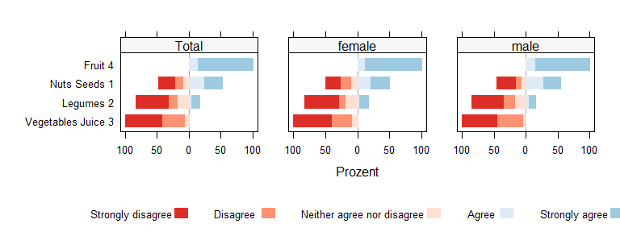

Likert-Grafiken
================

Likert-Skalen sind Fragenbatterien, die mit vorgegebenen mehrstufigen
Antwortskalen beantwortet werden. Die dazugehörigen Fragen (Items) sind
als strikt positive oder negative Aussagen formuliert.

Die Auswertung erfolgt bei rein deskriptiven Fragestellungen durch
Auszählung und Berechnung der Anteilswerte. Wenn die Stichprobe groß
genug ist, kann eine Likertskala auch als metrische Skala angesehen
werden und es können dann alle Kennzahlen wie z.B. Mittelwerte und
Korrelationen berechnet werden.

<!-- badges: start -->

[](https://www.tidyverse.org/lifecycle/#experimental)
[](https://CRAN.R-project.org/package=stp25stat2)
<!-- badges: end -->

### Likert -Tabelle

``` r
Likert |>
  Tbll_likert(q1, q2, q3, q4,
              ReferenceZero = 2.5) |> 
  kable(caption =" Likert-Skale")
```

| Item             | low(1:2) | high(3:5) | M(SD)       |
|:-----------------|:---------|:----------|:------------|
| Nuts Seeds       | 34% (55) | 66% (107) | 3.51 (1.46) |
| Legumes          | 30% (48) | 70% (114) | 3.30 (1.12) |
| Vegetables Juice | 25% (41) | 75% (121) | 3.20 (1.47) |
| Fruit            | 54% (88) | 46% (74)  | 2.87 (1.56) |

Likert-Skale

Die Lang-Form oder Breit-Form der Dataen kann mit `Summarise_likert()`
erzeugt werden.

``` r
Likert |>
  Summarise_likert(q1, q2, q3, q4) 
```

    ## # A tibble: 4 × 6
    ##   Item             `Strongly disagree` Disagree Neither agree nor disagr…¹ Agree
    ##   <fct>                          <int>    <int>                      <int> <int>
    ## 1 Nuts Seeds                        19       36                         10    38
    ## 2 Legumes                            0       48                         52    27
    ## 3 Vegetables Juice                  41        0                         46    36
    ## 4 Fruit                             42       46                          0    39
    ## # ℹ abbreviated name: ¹​`Neither agree nor disagree`
    ## # ℹ 1 more variable: `Strongly agree` <int>

``` r
Multi |>
  Summarise_likert(q1, q2, q3, q4) 
```

    ## # A tibble: 4 × 3
    ##   Item                  `1`   `0`
    ##   <fct>               <int> <int>
    ## 1 "Nuts.Seeds"           55    45
    ## 2 "Legumes"              46    54
    ## 3 "Vegetables Juice "    70    30
    ## 4 "Fruit"                57    43

## Klassiker Plot mit der HH Library

Die Funktion `likertplot()` ist ein Workaround für die Funktion
`HH:::plot.likert.formula`. Dabei kann ein ensprechender data.frame, das
mit der Funktion `Summarise_likert()` erzeugt wurde, mit allen
notwendigen Parametern direkt übergeben werden. Mit HH lassen sich die
Referenzlinien verschieben.

``` r
Likert |>
  Summarise_likert(q1, q2, q3, q4, 
                   include.total = TRUE, 
                   by =  ~ Sex)  |>
  likertplot(include.order = "r", ReferenceZero = 3.5, auto.key =list(columns=5))
```

<!-- -->

### Händich mit ggplot

``` r
require(ggplot2)
require(ggstats)
Multi |>
  Summarise_likert_long(q1, q2, q3, q4) |>
  ggplot() +
  aes(
    x = Item,
    fill = levels,
    weight = Freq,
    by = Item
  ) +
  geom_bar(position = "fill") +
  scale_fill_brewer(palette = "BrBG", direction  = 1) +
  geom_text(
    aes(label = scales::percent(after_stat(prop), accuracy = 1)),
    stat = "prop", position = position_fill(.5)) +
  coord_flip()
```

<!-- -->

### gglikert_stacked mit likert_data und multi_data

Neue Funktion `gg_likert_stacked()` diese habe die ich von Joseph
Larmarange gestohlern - siehe orginale Funktion unten.

``` r
#' Here is the function with my customised implementation of gglikert_stacked()
#' 
Multi |>
  Summarise_multi_long(
    q1,q2,q3,q4,q5,q6,q7,q8,q9,
    by =  ~ Sex,
    grouping = list(
      FC.2 = c("q1", "q2"),
      FC.3 = "q3",
      FC.4 =  c("q4", "q5", "q6"),
      FC.5 = c("q7", "q8", "q9")
    )
  ) |>
  gg_likert_stacked(
    .grouping ~ Sex) +
#  theme_bw() +
  theme(strip.text.y = element_text(angle = 0))
```

    ## .grouping ~ Sex

<!-- -->

``` r
  Likert |>
    Summarise_likert(
      q1,q2,q3,q4,q5,q6,q7,q8,q9,
      by =  ~ Sex + Age,
      grouping = list(
        FC.2 = c("q1", "q2"),
        FC.3 = "q3",
        FC.4 =  c("q4", "q5", "q6"),
        FC.5 = c("q7", "q8", "q9")
      ),
      include.order = TRUE
    ) 
```

    ## # A tibble: 54 × 9
    ##    .grouping Sex    Age   Item             `Strongly disagree` Disagree
    ##    <fct>     <fct>  <fct> <fct>                          <int>    <int>
    ##  1 FC.2      female >50   Nuts Seeds                         1        5
    ##  2 FC.2      female 18-30 Nuts Seeds                         6        9
    ##  3 FC.2      female 30-50 Nuts Seeds                         6        7
    ##  4 FC.2      female >50   Legumes                            0        5
    ##  5 FC.2      female 18-30 Legumes                            0       17
    ##  6 FC.2      female 30-50 Legumes                            0        6
    ##  7 FC.3      female >50   Vegetables Juice                   8        0
    ##  8 FC.3      female 18-30 Vegetables Juice                   9        0
    ##  9 FC.3      female 30-50 Vegetables Juice                   4        0
    ## 10 FC.4      female >50   Fruit                             10        9
    ## # ℹ 44 more rows
    ## # ℹ 3 more variables: `Neither agree nor disagree` <int>, Agree <int>,
    ## #   `Strongly agree` <int>

``` r
#' Das ist eine Kopie von ggstats::gglikert wobei default Einstellungen geändert sind
#' und vor allem die anpassung an meine Summarise_likert() Funktion
```

Quelle: Bibliothek ‘ggstats’

<https://github.com/larmarange/ggstats>
