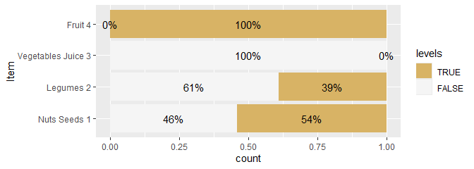

Likert-Grafiken
================

Likert-Skalen sind Fragenbatterien, die mit vorgegebenen mehrstufigen
Antwortskalen beantwortet werden. Die dazugehörigen Fragen (Items) sind
als strikt positive oder negative Aussagen formuliert.

Die Auswertung erfolgt bei rein deskriptiven Fragestellungen durch
Auszählung und Berechnung der Anteilswerte. Wenn die Stichprobe groß
genug ist, kann eine Likertskala auch als metrische Skala angesehen
werden und es können dann alle Kennzahlen wie z.B. Mittelwerte und
Korrelationen berechnet werden.

<!-- badges: start -->

[](https://www.tidyverse.org/lifecycle/#experimental)
[](https://CRAN.R-project.org/package=stp25stat2)
<!-- badges: end -->

### Likert -Tabelle

``` r
dat_l <-
  Tbll_likert(DF2,
              Magazines,
              Comic.books,
              Fiction,
              Newspapers,
              ReferenceZero = 2.5)

dat_l |> kable(caption =" Likert-Skale")
```

| Item        | low(1:2) | high(3:5) | M(SD)       |
|:------------|:---------|:----------|:------------|
| Magazines   | 17% (17) | 83% (83)  | 3.42 (1.02) |
| Comic.books | 47% (47) | 53% (53)  | 2.59 (1.00) |
| Fiction     | 29% (29) | 71% (71)  | 3.06 (0.96) |
| Newspapers  | 50% (50) | 50% (50)  | 2.60 (1.05) |

Likert-Skale

``` r
dat_lg <- Tbll_likert(
  DF2,
  Magazines,
  Comic.books,
  Fiction,
  Newspapers,
  by =  ~ Geschlecht,
  include.order = TRUE
)

dat_lg
```

    ## # A tibble: 8 × 8
    ##   Geschlecht Item        `--`     `-`      o        `+`      `++`    `M(SD)`    
    ## * <fct>      <fct>       <chr>    <chr>    <chr>    <chr>    <chr>   <chr>      
    ## 1 m          Magazines   4% (3)   9% (6)   37% (25) 36% (24) 13% (9) 3.45 (0.99)
    ## 2 f          Magazines   3% (1)   21% (7)  27% (9)  33% (11) 15% (5) 3.36 (1.08)
    ## 3 f          Fiction     3% (1)   27% (9)  36% (12) 27% (9)  6% (2)  3.06 (0.97)
    ## 4 m          Fiction     4% (3)   24% (16) 39% (26) 27% (18) 6% (4)  3.06 (0.97)
    ## 5 f          Newspapers  9% (3)   33% (11) 27% (9)  21% (7)  9% (3)  2.88 (1.14)
    ## 6 m          Comic.books 12% (8)  33% (22) 33% (22) 18% (12) 4% (3)  2.70 (1.04)
    ## 7 m          Newspapers  16% (11) 37% (25) 33% (22) 10% (7)  3% (2)  2.46 (0.99)
    ## 8 f          Comic.books 18% (6)  33% (11) 42% (14) 6% (2)   . (0)   2.36 (0.86)

Die Lang-Form der Dataen kann mit `likert_data()` erzeugt werden.

     DF2 |>
       likert_data(
         Magazines, Comic.books, Fiction, Newspapers,
         by = ~ Geschlecht,
         include.total = TRUE
     )

oder auch aus dem Tbll_likert - Objekt

``` r
likert_data(dat_lg)
```

    ## # A tibble: 40 × 4
    ##    Geschlecht Item        levels  Freq
    ##    <fct>      <fct>       <fct>  <int>
    ##  1 m          Magazines   --         3
    ##  2 m          Magazines   -          6
    ##  3 m          Magazines   o         25
    ##  4 m          Magazines   +         24
    ##  5 m          Magazines   ++         9
    ##  6 m          Comic.books --         8
    ##  7 m          Comic.books -         22
    ##  8 m          Comic.books o         22
    ##  9 m          Comic.books +         12
    ## 10 m          Comic.books ++         3
    ## # ℹ 30 more rows

## Klassiker Plot mit der HH Library

Die Funktion `likertplot()` ist ein Workaround für die Funktion
`HH:::plot.likert.formula`. Dabei kann ein Objekt, das mit der Funktion
`Tbll_likert()` erzeugt wurde, mit allen notwendigen Parametern direkt
übergeben werden. Mit HH lassen sich die Referenzlinien verschieben.

``` r
cowplot::plot_grid(
  likertplot(dat_l,
             auto.key = list(columns = 5)),
  likertplot(
    Item ~ . | Geschlecht,
    data = dat_lg,
    auto.key = list(columns = 5)
  ),
  ncol = 2,
rel_widths = c(2,3)
)
```

<!-- -->

### Händich mit ggplot

``` r
dat <- attr(dat_l, "plot")$results
save_lvl <- names(dat)
names(dat) <- c("Item", "l1", "l2", "l3", "l4", "l5")

dat <-   Long(. ~ Item , dat, value = "Freq")
levels(dat$variable) <- save_lvl[-1]

  ggplot(dat) +
  aes(
    x = Item,
    fill = variable ,
    weight = Freq,
    by = Item
  ) +
  geom_bar(position = "fill") +
  geom_text(
     aes(label = scales::percent(after_stat(prop), accuracy = 1)),
     stat = "prop", position = position_fill(.5)) +
     coord_flip()
```

<!-- -->

``` r
#' Die Zeile  
#' stat = "prop", position = position_fill(.5))  
#' ist eine Funktion aus ggstats::stat_prop
```

### gglikert_stacked mit likert_data und multi_data

Neue Funktion `gglikert_stacked()` diese habe die ich von Joseph
Larmarange gestohlern - siehe orginale Funktion unten.

``` r
#' Here is the function with my customised implementation of gglikert_stacked()
#' 
DF_multi |>
  multi_data(
    q1,q2,q3,q4,q5,q6,q7,q8,q9,
    by =  ~ Sex + Age,
    grouping = list(
      FC.2 = c("q1", "q2"),
      FC.3 = "q3",
      FC.4 =  c("q4", "q5", "q6"),
      FC.5 = c("q7", "q8", "q9")
    ),
    include.order = TRUE
  ) |>
  stp25likert::gglikert_stacked(
    include =levels,
    weights = Freq,
    y = Item,) +
  facet_grid(.grouping ~ Sex, 
             scales = "free", 
             space = "free") +
  theme_bw() +
  theme(strip.text.y = element_text(angle = 0))
```

<!-- -->

``` r
  DF_likert |>
    likert_data(
      q1,q2,q3,q4,q5,q6,q7,q8,q9,
      by =  ~ Sex + Age,
      grouping = list(
        FC.2 = c("q1", "q2"),
        FC.3 = "q3",
        FC.4 =  c("q4", "q5", "q6"),
        FC.5 = c("q7", "q8", "q9")
      ),
      include.order = TRUE
    ) |>
    stp25likert::gglikert(
      include =levels,
      weights = Freq,
      y = Item,
      add_labels = FALSE,
      add_totals = TRUE,
      ) +
    facet_grid(.grouping ~ Sex, 
               scales = "free", 
               space = "free") +
    theme_bw() +
    theme(strip.text.y = element_text(angle = 0))
```

<!-- -->

``` r
#' Das ist eine Kopie von ggstats::gglikert wobei default Einstellungen geändert sind
#' und vor allem die anpassung an meine likert_data() Funktion
```

``` r
DF_likert |>
    likert_data(
      q1, q2, q3, q4, q5, q6, q7, q8, q9,
      by = ~ Sex + Age,
      grouping = list(
        FC.2 = c("q1", "q2"),
        FC.3 = "q3",
        FC.4 =  c("q4", "q5", "q6"),
        FC.5 = c("q7", "q8", "q9")
      ),
      include.order = TRUE
    ) |>
    ggstats::gglikert_stacked(
              include =levels,
              weights = Freq,
              y = Item) +
    facet_grid(
             .grouping ~ Sex, 
             scales = "free", 
             space = "free") +
    theme_bw() +
    theme(strip.text.y = element_text(angle = 0))
```

<!-- -->

``` r
#'  stp25likert::gglikert_stacked ist eine alte Kopie von
#'  ggstats::gglikert_stacked die neue Variante hat etwas mehr einstellungen
```

## Likert-Plot mit ggstats

Optisch ansprechendere Plots lassen sich mit der Bibliothek ‘ggstats’,
erzeugen.

<https://github.com/larmarange/ggstats>

``` r
#' Hier das Orginal
#'  
ggstats::gglikert(
  DF2,
  c(Magazines,
    Comic.books,
    Fiction,
    Newspapers),
  facet_cols = vars(Geschlecht),
   add_totals =FALSE,
  labels_size = 3
)
```

<!-- -->
